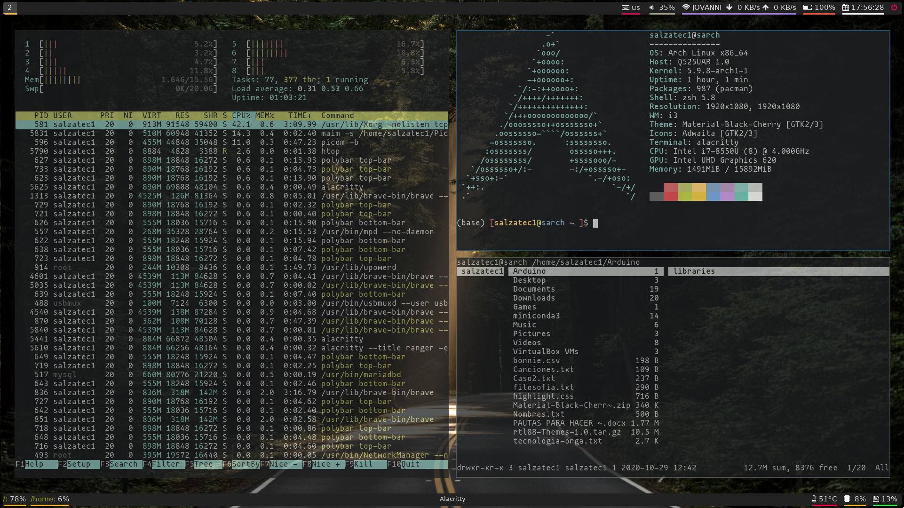

# Snatiolam Dotfiles & Configs



***Quick links***
- [i3wm-config](.config/i3/config)
- [vimfile](.vimrc)
- [polybar](.config/polybar/config)

# Table of contents
- [Software](#software-i-use)
  - [Basic utilities](#basic)
  - [Fonts, theming and GTK](#theming)
  - [Apps](#apps)

# Software I Use

## Basic

| Software                                                              | Utility                                      |
| --------------------------------------------------------------------- | -------------------------------------------- |
| [networkmanager](https://wiki.archlinux.org/index.php/NetworkManager) | Managing network                             |
| network-manager-applet                                                | networkmanager tray                          |
| pulseaudio                                                            | Proxy for sound/sound system                 |
| pavucontrol                                                           | GUI for pulse audio                          |
| [udiskie](https://wiki.archlinux.org/index.php/udisks)                | Wrapper of udisks for automount              |
| [dunst](https://wiki.archlinux.org/index.php/Dunst)                   | Notification system                          |
| [lightdm](https://wiki.archlinux.org/title/LightDM)                   | Display Manager (Login)                      |
| [rofi](https://github.com/davatorium/rofi) / dmenu                    | Application Launcher                         |
  
---
**NOTE**

If you are using pulseaudio in an Asus Zenbook machine please read this: [Asus Zenbook UX390](https://wiki.archlinux.org/title/ASUS_Zenbook_UX390_(Espa%C3%B1ol))

Also headphones may also fail: [Here](https://askubuntu.com/questions/132440/headphone-jack-not-working)

Configure .xprofile since your ~/.xinitrc won't be loaded if you are using lightdm

---


## Theming

| Software                                                        | Utility                         |
| --------------------------------------------------------------- | ------------------------------- |
| feh                                                             | CLI for setting wallpapers      |
| picom                                                           | Compositor for Xorg             |
| lxappearance                                                    | GUI for changing themes         |
| [Material-Black-Cherry](https://www.gnome-look.org/p/1316887/)  | GTK-Theme                       |
| [Material-Black-Cherry-Numix](https://www.pling.com/p/1333360/) | GTK-Icons                       |
| [Nerd Fonts](https://www.nerdfonts.com/) (Hack)                 | Stable fonts (support glyphs)   |

## Apps

| Software                                                              | Utility                          |
| ------------------------------------------------------------------------- | -------------------------------- |
| Alacritty / rxvt-unicode (urxvt)                                          | Terminal emulator                |
| Vim / Neovim                                                              | Best editor ever                 |
| [maim](https://github.com/naelstrof/maim)                                 | Take screenshots                 |
| redshift                                                                  | Eye care                         |
| ranger                                                                    | Terminal file manager            |
| thunar                                                                    | GUI file manager                 |
| [mpd](https://wiki.archlinux.org/index.php/Music_Player_Daemon)           | music player daemon              |
| ncmpcpp                                                                   | Client for mpd                   |
| [OpenShot](https://www.openshot.org/)                                     | Video Editor                     |
| [SongRec](https://github.com/marin-m/SongRec)                             | Song recognition (Shazam client) |
| [OBS](https://obsproject.com/)                                            | Screen recording / streaming     |
| [mpv](https://mpv.io/)/[vlc](https://www.videolan.org/vlc/)               | Video players                    |
| [firejail](https://wiki.archlinux.org/title/firejail)                     | Reduce risk of security breaches |
| [syncthing-gtk](https://wiki.archlinux.org/title/Syncthing#Syncthing-GTK) | Sync my pc with my phone         |

### File Manager

If you are trying to open your file explorer and is not opening the one you want by default
you can set the default file manager by simply typing.

```sh
application="thunar.desktop"
xdg-mime default $application inode/directory
```
